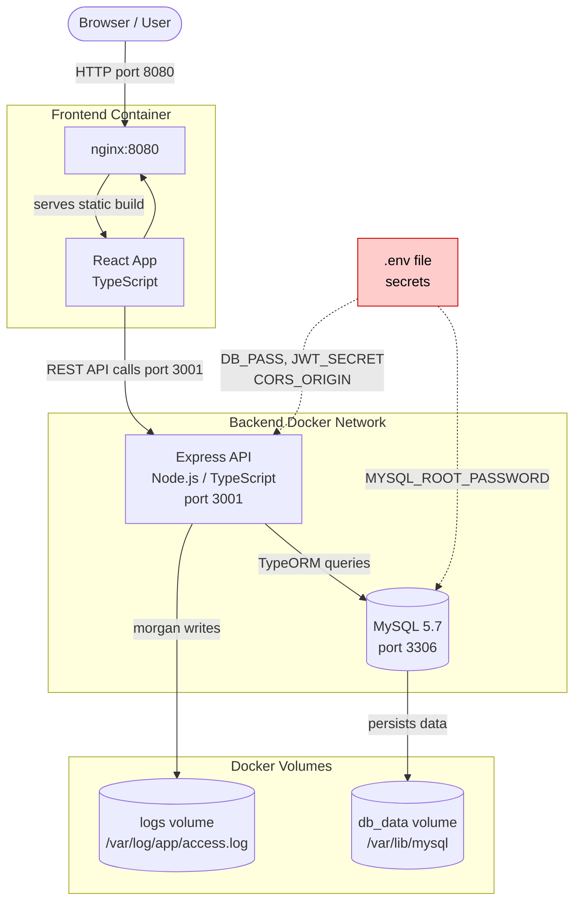
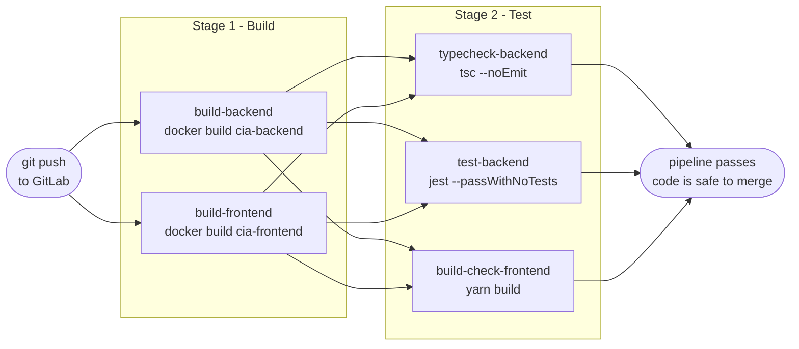
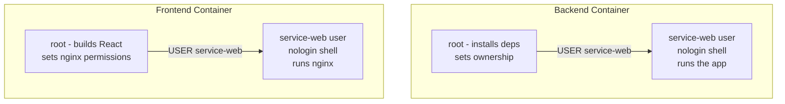

# CIA Project Architecture

## Application Architecture

```mermaid
flowchart TB
    User([Browser / User])

    subgraph Frontend Container
        direction TB
        NGINX[nginx:8080]
        REACT[React App\nTypeScript]
        REACT --> NGINX
    end

    subgraph Backend Docker Network
        direction TB
        API[Express API\nNode.js / TypeScript\nport 3001]
        DB[(MySQL 5.7\nport 3306)]
        API -->|TypeORM queries| DB
    end

    subgraph Docker Volumes
        LOG_VOL[(logs volume\n/var/log/app/access.log)]
        DB_VOL[(db_data volume\n/var/lib/mysql)]
    end

    User -->|HTTP port 8080| NGINX
    NGINX -->|serves static build| REACT
    REACT -->|REST API calls port 3001| API
    API -->|morgan writes| LOG_VOL
    DB -->|persists data| DB_VOL

    ENV[.env file\nsecrets]:::secret
    ENV -.->|DB_PASS, JWT_SECRET\nCORS_ORIGIN| API
    ENV -.->|MYSQL_ROOT_PASSWORD| DB

    classDef secret fill:#ffcccc,stroke:#cc0000,color:#000
```

## CI Pipeline

```mermaid
flowchart LR
    PUSH([git push\nto GitLab])

    subgraph Stage 1 - Build
        direction TB
        B1[build-backend\ndocker build cia-backend]
        B2[build-frontend\ndocker build cia-frontend]
    end

    subgraph Stage 2 - Test
        direction TB
        T1[typecheck-backend\ntsc --noEmit]
        T2[test-backend\njest --passWithNoTests]
        T3[build-check-frontend\nyarn build]
    end

    RESULT([pipeline passes\ncode is safe to merge])

    PUSH --> B1 & B2
    B1 & B2 --> T1 & T2 & T3
    T1 & T2 & T3 --> RESULT
```

## Container Security

```mermaid
flowchart TB
    subgraph Backend Container
        ROOT_B[root - installs deps\nsets ownership]
        SW_B[service-web user\nnologin shell\nruns the app]
        ROOT_B -->|USER service-web| SW_B
    end

    subgraph Frontend Container
        ROOT_F[root - builds React\nsets nginx permissions]
        SW_F[service-web user\nnologin shell\nruns nginx]
        ROOT_F -->|USER service-web| SW_F
    end
```
